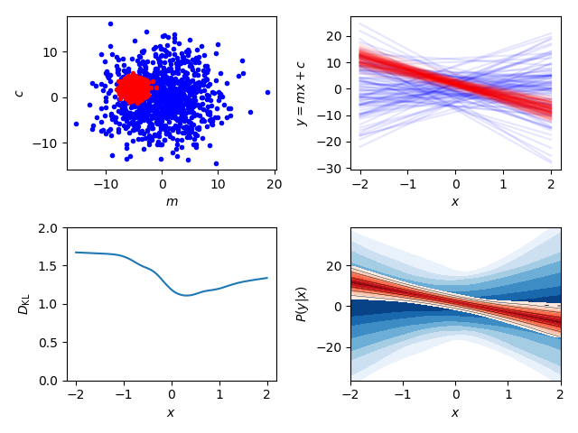

# Summary

Scientists are often concerned with numerical values of parameters in
scientific models. Our knowledge of such things can be quantified and presented
as a probability distribution:

 

Plots such as the above can be created using two-dimensional kernel density
estimation using packages such as
[scipy](https://docs.scipy.org/doc/scipy/reference/generated/scipy.stats.gaussian_kde.html),
[getdist](http://getdist.readthedocs.io/en/latest/intro.html) and
[corner](https://corner.readthedocs.io/en/latest/), where the samples provided
as inputs to such programs are typically created by a Markov-Chain-Monte-Carlo
analysis.

As well as uncertain parameters, scientists can also be concerned with
uncertain functional relationships. Take as a universally relatable case the
equation of a straight line ``y = m*x + c``. If one measured the gradient ``m``
and intercept ``c`` with some uncertainty, then our ability to predict ``y``
from ``x`` using the straight line relationship would also be uncertain, and
plotted like:

 

The above example is a little over-simplified, but the code has been used in
the latest two Planck inflation papers [-@inflation2015][-@inflation2018] to
quantify our knowledge of the primordial power spectrum of curvature
perturbations, by [@Hee2015] in examining the dark energy equation of state
(and later by [@Hee2016]), by [@Higson2017] for measuring errors in parameter
estimation and by [@Higson2018] for providing diagnostic tests for nested
sampling.                

``fgivenx`` is a package for functional posterior plotting, currently used in
astronomy, but will be of use to any scientists performing a Bayesian analysis
which have predictive posteriors that are functions. The source code for
``fgivenx`` is available on
[github](https://github.com/williamjameshandley/fgivenx) and has been archived to
Zenodo with the linked DOI: [@zenodo] 

# Acknowledgements

We acknowledge contributions from Ed Higson

# References
